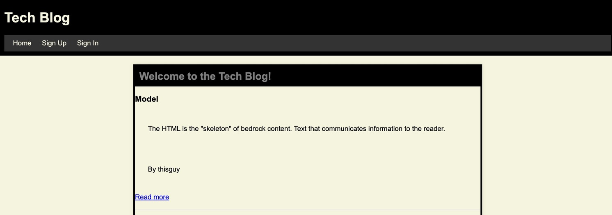

# tech-blog

## Description

Check out this CMS-style blog site similar to a Wordpress site, where developers can publish their blog posts and comment on other developers’ posts as well!

## Installation

What are the steps required to install your project? Provide a step-by-step description of how to get the development environment running.

## Usage

Heroku Link: https://git.heroku.com/tech-blog19.git 

## License

Please refer to the license in the repo.

